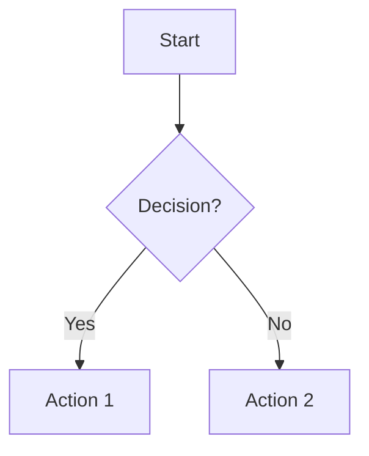

# The Distributor Design Scratchpad

Scratchpad for The Distributor Design/Data implementation

## Flowchart

Test Diagram:

```mermaid
graph TB
    A[Start] --> B{Decision?}
    B -->|Yes| C[Action 1]
    B -->|No| D[Action 2]
```
